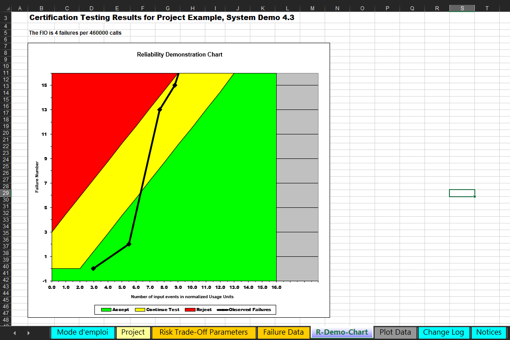
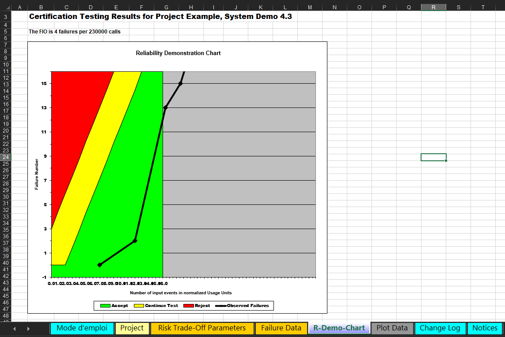
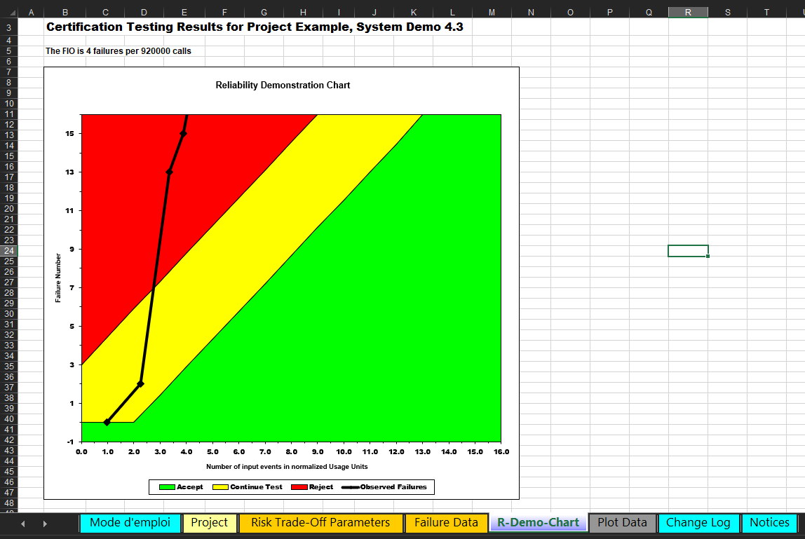
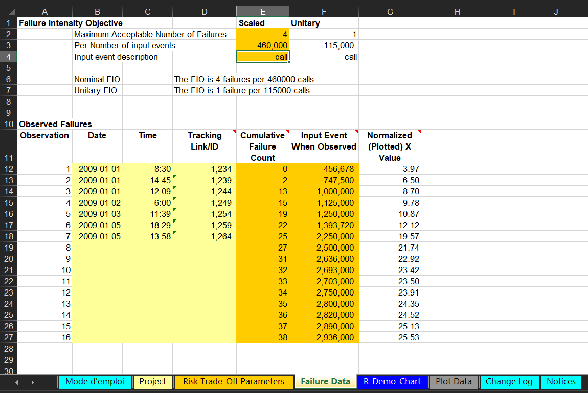
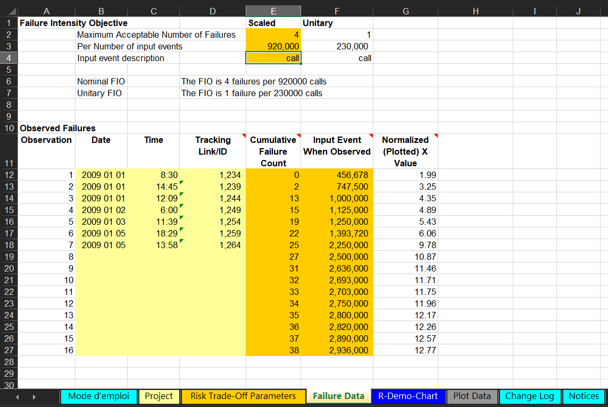

# SENG 637 - Dependability and Reliability of Software Systems
## Assignment \#5<br/>
> **Software Reliability Assessment**<br/>
> Instructors: Dr. Behrouz Far (far@ucalgary.ca)<br/>
> Department of Electrical and Software Engineering<br/>
> University of Calgary<br/>

Due Date: March 24, 2025

**Lab. Report \#5 – Mutation Testing and Web app testing**

| Group: 18      |
|-----------------|
| Abubakar Khalid      |
| Ahmed Shehata      |
| Jinyu Wang      |
| Mohammad Abu Saleh      |

# 1. Introduction

Reliability engineering plays a vital role in ensuring that software systems can operate consistently and predictably under expected workloads. In software development, assessing and improving system reliability is not only crucial for functionality but also for user trust, safety, and cost-effectiveness. As systems become increasingly complex and integrated with critical infrastructure, ensuring high reliability becomes a central objective in the software lifecycle.

This assignment explores two key methods used in software reliability evaluation: **Reliability Growth Testing** and **Reliability Demonstration Charts (RDC)**. The primary goal is to analyze real-world failure data and apply these methods to extract insights about the system's failure patterns and overall dependability. 

In **Section 2**, we utilize the **C-SFRAT** (Covariate Software Failure and Reliability Assessment Tool) to perform reliability growth analysis. C-SFRAT applies hazard-based statistical models to failure datasets, incorporating various covariates such as test effort and environmental conditions. This approach helps evaluate reliability trends and predict future failure behavior.

In **Section 3**, we employ the **Reliability-Demonstration-Chart.xls** tool to test the system’s compliance with predefined reliability thresholds. This method enables a pass/fail style of decision-making by plotting normalized failure data against acceptance criteria. Through visual inspection and threshold comparison, we determine whether the system meets its required Mean Time To Failure (MTTF).

Subsequent sections include a comparative analysis of the two techniques (Section 4), a discussion on their similarities and differences (Section 5), insights on team collaboration (Section 6), and a reflection on encountered challenges and lessons learned (Section 7).

This assignment not only emphasizes tool-based reliability assessment but also reinforces the importance of collaborative problem-solving, data interpretation, and critical thinking in software engineering practice.

# 2. Assessment Using Reliability Growth Testing

## 2.1 Introduction

In this section, we assess the software system's reliability growth using the **C-SFRAT** (Covariate Software Reliability Assessment Tool) framework. C-SFRAT enables the analysis of time-to-failure data using various statistical hazard models and the inclusion of covariates representing effort-related factors. The objective is to:

- Analyze failure behavior over time,
- Fit multiple reliability growth models,
- Evaluate the effect of covariates (effort variables),
- Compare model performance using statistical criteria, and
- Allocate testing effort to optimize defect discovery.

This process was executed in four stages, corresponding to the tabs in the C-SFRAT interface:
1. Data Upload and Model Selection
2. Model Results and Predictions
3. Model Comparison
4. Effort Allocation

Each subsection below explains the procedure followed, the options selected (and those not selected), and the rationale behind each decision.

---

## 2.2 Tab 1 – Data Upload and Model Selection


This tab is the starting point of the reliability assessment process, where the dataset is imported and the core modeling configuration is set.

### 2.2.1 Data Selection and Subsetting
- **Input File**: `failure-dataset-a5.csv`
- **Subset Failure Data**: Set to **31**
  - This means we used all 31 recorded intervals (full dataset).
  - *Why?* We aimed to preserve the entire time-to-failure series to better capture the full reliability growth behavior.

### 2.2.2 Hazard Function Selection
We selected the following hazard models:
- **Discrete Weibull (Order 2)**
- **Geometric**
- **Negative Binomial (Order 2)**

These were chosen based on:
- **Diversity in distribution behavior**: 
  - *Weibull* is versatile for increasing/decreasing hazard rates,
  - *Geometric* assumes a memoryless property (useful for simplicity),
  - *Negative Binomial* captures overdispersion and varied defect rates.
- **Literature support**: These are commonly used models referenced in the C-SFRAT publication (`1-s2.0-S2352711021001588-main.pdf`).

> ❌ **Not Selected**: Continuous Weibull, Salvia & Bollinger, S-Distribution, etc.
> These were skipped to keep the modeling computationally manageable and focus on discrete models better suited to count-based failure data.

### 2.2.3 Covariate Selection
- **Selected All**: E, F, C, and all their combinations
  - `E`: Developer experience
  - `F`: Testing frequency
  - `C`: Complexity
- *Why?* To evaluate the impact of individual and combined effort-related factors on model performance and failure behavior.

> ❌ **Not Selected**: “None” alone — instead, we included both with and without covariates to compare model behavior in controlled and real-world effort-influenced scenarios.

### 2.2.4 Estimation
- After selection, we clicked **Run Estimation**, triggering model training and statistical fitting using Maximum Likelihood Estimation (MLE).

### 2.2.5 Output
- Two critical plots were generated from this step:
  1. **Failure Intensity Plot**: Shows defect discovery rate across intervals.
     - 
  2. **MVF (Mean Value Function) Plot**: Displays cumulative defect trend over time.
     - 

We also exported their tabular data:
- `Tab1_Intensity.xlsx` – Defect rate over time
- `Tab1_MVF.xlsx` – Cumulative failures by interval

### Interpretation (for next section):
These plots confirm an initial rise in failures, followed by gradual stabilization—indicative of potential reliability growth. Formal model results and prediction insights are discussed in Section 2.3.

## 2.3 Tab 2 – Model Results and Predictions


This tab allowed us to visualize and compare the fitted models' predictions against the actual failure data using plots and numerical tables.

---

### 2.3.1 Model Selection for Analysis

We selected a representative set of models for performance comparison:

- **DW2 (None)** – baseline model with no covariates
- **DW2 (C)** – DW2 with complexity (C) as covariate
- **GM (None)** – Generalized model without covariates
- **GM (E)** – GM with experience (E)
- **GM (E, F, C)** – GM with all covariates
- **NB2 (None)** – Negative Binomial baseline
- **NB2 (E, C)** – NB2 with effort-related covariates

This selection aimed to include:
- Simpler models to observe raw failure trends
- Covariate-enhanced models to observe improvements from effort-related variables

### 2.3.2 Prediction Parameters

We configured prediction settings to simulate future testing:

- **Effort per Interval**:
  - `E = 1.00`
  - `F = 2.00`
  - `C = 3.00`
- **Number of Intervals to Predict**: `5`
- **Failure Intensity Target**: `0.0000` (default/no threshold)

These settings enabled forecasting model behavior across five additional testing intervals with realistic effort levels.

---

### 2.3.3 Output Visualizations

#### A. Failure Intensity Plot


- The bar graph shows actual failure intensity per interval.
- Overlaid curves represent each model’s predicted intensity.
- Observations:
  - **GM (E, F, C)** aligns closely with intensity spikes, adapting better to effort variables.
  - **DW2 (None)** provides smoother, less reactive predictions.
  - **NB2** models show moderate fit, overestimating some intensity spikes.

> *Conclusion*: Covariate models provide better granularity for forecasting actual failure rates over time.

#### B. MVF (Mean Value Function) Plot


- The MVF plot shows cumulative predicted failures.
- **GM (E, F, C)** and **NB2 (E, C)** closely track the observed stepwise failure curve.
- Non-covariate models like **DW2 (None)** deviate slightly under high failure accumulation.

> *Conclusion*: Models that include effort factors yield better alignment with real-world cumulative defect trends.

---

### 2.3.4 Numerical Forecast Table

The prediction table contains the estimated cumulative failures for each model across intervals.

- 
- Exported to: `Tab2_MVF.xlsx`, `Tab2_Intensity.xlsx`

#### Key Values at Interval 25 (from `Tab2_MVF.xlsx`):
| Model          | Predicted Cumulative Failures |
|----------------|-------------------------------|
| DW2 (None)     | 75.24                         |
| GM (None)      | 69.61                         |
| GM (E, F, C)   | **73.02**                     |
| NB2 (E, C)     | 70.98                         |

This supports the earlier visual conclusions that **GM (E, F, C)** offers the best predictive performance overall.

---

### 2.3.5 Summary

- **GM (E, F, C)** emerges as the best model by combining:
  - Strong fit to observed data
  - Accurate prediction of future failures
  - Consideration of real-world effort factors

- **DW2 (None)** serves as a valuable benchmark model with minimal assumptions.

These results form the basis for model comparison (Tab 3) and resource planning (Tab 4), discussed next.

## 2.4 Tab 3 – Model Comparison


The **Model Comparison** tab in C-SFRAT allows us to evaluate the performance of each model using quantitative metrics. This helps identify the most accurate and appropriate models for analysis and prediction.

---

### 2.4.1 Comparison Criteria

We used the default metric weights:

| Metric | Weight | Description |
|--------|--------|-------------|
| LLF (Log-Likelihood Function) | 1 | Measures model fit to data (higher is better) |
| AIC (Akaike Information Criterion) | 1 | Penalizes complexity while rewarding fit (lower is better) |
| BIC (Bayesian Information Criterion) | 1 | Similar to AIC but stronger penalty for complexity |
| SSE (Sum of Squared Errors) | 1 | Measures how well model fits the actual data |
| PSSE (Predictive SSE) | 0 | Ignored in this comparison to prioritize in-sample fit |

- **Subset data for PSSE**: 90% of the dataset was used for fitting, with the remaining 10% for testing prediction accuracy.
- *Why these defaults?* We prioritized model fitting and simplicity. PSSE was excluded to keep the focus on model accuracy over the current dataset rather than its predictive power.

---

### 2.4.2 Model Evaluation Table

| Model | Covariates | Log-Likelihood | AIC | BIC | SSE | PSSE |
|-------|------------|----------------|-----|-----|-----|------|
| DW2   | None       | -92.571        | 189.141 | 192.009 | 2031.486 | 11.611 |
| DW2   | C          | -89.074        | 184.149 | 188.451 | 2208.983 | 32.082 |
| GM    | None       | -74.982        | 153.963 | 156.831 | 917.068  | 110.422 |
| GM    | E          | -72.700        | 151.400 | 155.702 | 1114.328 | 99.513  |
| GM    | E, F, C    | **-59.653**    | **129.306** | **136.476** | **744.943** | **218.799** |
| NB2   | None       | -83.714        | 171.428 | 174.296 | 1599.496 | 18.553  |
| NB2   | E, C       | -80.347        | 168.694 | 174.430 | 1958.543 | 77.571  |

---

### 2.4.3 Key Insights

- ✅ **GM (E, F, C)** had the best overall fit across **AIC**, **BIC**, and **SSE**, indicating strong modeling of defect behavior with covariates.
- ✅ **DW2 (None)** achieved the **lowest PSSE**, meaning it predicted unseen data best.
- 🔁 **NB2 models** offered a reasonable balance but did not outperform GM or DW2 across any metric.

> **Conclusion**: We selected:
> - **GM (E, F, C)** as the best-fit model (strong internal accuracy)
> - **DW2 (None)** as the most generalizable model (low predictive error)

---

### 2.4.4 Exported Results

The full comparison table is saved as:
- `Tab3.xlsx`

These insights directly inform our testing resource decisions in the next step — Tab 4: Effort Allocation.

## 2.5 Tab 4 – Effort Allocation


The **Effort Allocation** tab in C-SFRAT is designed to help guide resource planning by estimating how testing effort correlates with defect discovery. It includes two allocation strategies:
- **Allocation 1**: Estimate how many defects can be discovered within a given test budget.
- **Allocation 2**: Estimate the minimum effort required to uncover a specified number of additional defects.

---

### 2.5.1 Models Selected for Allocation

We selected the following models for allocation analysis:

- **DW2 (C)**: A variation of Discrete Weibull using complexity as the only covariate.
- **GM (E, F, C)**: The best overall model based on model comparison (Tab 3).

These models represent:
- A basic model with a single covariate (DW2 C) to observe simple behavior.
- A comprehensive model with all effort-related covariates (GM E, F, C) to maximize predictive depth.

---

### 2.5.2 Allocation 1 – Maximize Defect Discovery Within Budget

**Budget**: `20.00` effort units

**Procedure**:
- We entered a total effort budget of 20.00 units and ran the allocation for both models.
- The tool estimated how many additional defects could be discovered using this effort.

**Purpose**:
- Understand how far continued testing can take us within resource constraints.

**Result** *(as seen in Tab4 interface)*:
- **GM (E, F, C)** showed a higher estimated defect discovery than **DW2 (C)**, reinforcing its strength in guiding testing effort allocation.

---

### 2.5.3 Allocation 2 – Minimum Effort for Target Defect Count

**Target Additional Defects**: `5`

**Procedure**:
- We specified that we want to discover 5 more defects.
- The tool calculated the minimum required effort for each model to achieve this.

**Purpose**:
- Helps answer: *"What will it cost to find 5 more bugs?"*

**Result**:
- **GM (E, F, C)** required a smaller budget than **DW2 (C)**, further validating that models incorporating effort factors provide more cost-effective recommendations.

---

## 2.6 Key Insights

- **GM (E, F, C)** remains the most resource-efficient and accurate model for effort planning.
- **DW2 (C)**, while simpler, requires more effort to yield comparable results.
- The combination of Allocation 1 and 2 provides actionable insights for release planning and resource prioritization.

---

### 2.6.1 Result of Model Comparison

As detailed in **Section 2.4**, we selected the following two models based on performance:
- **GM (E, F, C)**: Strongest fit, lowest AIC/BIC/SSE, highly responsive to effort data.
- **DW2 (None)**: Best PSSE, making it the most generalizable for unseen data.

This selection balanced model precision with generalization and shaped further analysis in effort allocation and decision-making.

---

### 2.6.2 Result of Range Analysis

As configured in **Section 2.2**, we used the full failure interval range (Subset = 31) for all analyses. The dataset showed consistent failure trends across all intervals, with the cumulative failure plot (MVF) revealing stabilization after interval 25. Thus, the entire range was retained for maximal data utilization and reliability insights.

---

### 2.6.3 Failure Rate and Reliability Plots

Plots illustrating failure rate and reliability over time were generated through:
- **Failure Intensity Graphs** (Section 2.3.3)
- **MVF/Cumulative Reliability Graphs** (Section 2.3.3)

These highlight:
- Declining failure intensity in the latter intervals.
- Converging MVF curves for most models, supporting reliability stabilization.

These plots serve as a visual confirmation of system improvement through ongoing testing and effort investment.

---

### 2.6.4 Discussion on Decision-Making with a Target Failure Rate

Although we did not explicitly set a failure intensity threshold (kept at 0.0000), the analysis framework supports configuring such targets. Using effort allocation features, stakeholders can:
- Determine effort needed to meet desired failure intensity.
- Plan release schedules around reaching specific reliability thresholds.
- Assess trade-offs between additional testing and cost/benefit.

GM (E, F, C), given its superior prediction of failure trends, would be optimal for future decision-making involving target failure rate validation.

---

### 2.6.5 Advantages and Disadvantages of Reliability Growth Analysis

#### ✅ Advantages:
- Quantifies system reliability trends over time.
- Models can incorporate real-world effort factors (e.g., testing intensity, complexity).
- Supports proactive planning and release readiness evaluations.
- Enables failure prediction and testing resource allocation.

#### ⚠️ Disadvantages:
- Requires failure data in interval format (structured and clean).
- Model selection and interpretation demand statistical understanding.
- Overfitting risk with excessive covariate inclusion.
- Output interpretation may vary based on input effort estimation quality.

---

## 2.7 Difficulties Encountered and Lessons Learned

### ⚠️ Challenges:
- Understanding and properly configuring hazard models.
- Interpreting AIC/BIC/SSE vs PSSE during model selection.
- Aligning predictions with testing intervals and effort parameters.
- Matching graph outputs to report expectations.

### ✅ Overcome By:
- Referring to the provided academic papers on C-SFRAT usage.
- Step-by-step validation through each tab and setting.
- Visual confirmation of trends via intensity and MVF plots.

### 🧠 Lessons Learned:
- Covariate-aware models drastically improve reliability forecasting.
- Visual analytics are essential for confirming statistical insights.
- Full use of C-SFRAT’s effort planning tools enhances actionable decision-making.

---

## 2.8 Conclusion of Reliability Growth Assessment

The C-SFRAT analysis supports the following:
- The system exhibits **reliability growth**, as shown by cumulative failure stabilization and declining intensity in certain intervals.
- **Effort-related covariates (E, F, C)** significantly improve model fit and predictive accuracy.
- **GM (E, F, C)** should be used as the primary guide for future resource allocation and readiness evaluation.

With this analysis complete, the next section will compare this methodology with alternative reliability evaluation techniques such as RDC.

# Section 3: Assessment Using Reliability Demonstration Chart (RDC)

---

## 3.1 Introduction to RDC

In this section, we evaluate the software system under test (SUT) using the **Reliability Demonstration Chart (RDC)**, a tool designed to assess whether the SUT meets predefined reliability requirements based on observed failure data. The RDC utilizes a graphical technique where the **failure count** is plotted on the Y-axis, and **normalized failure times (Tₙ)** are plotted on the X-axis. The goal is to determine whether the failure trend indicates acceptable reliability.

The RDC Excel tool and manual were downloaded from SourceForge and tested with different configurations to ensure proper functionality. We consulted the RDC documentation (see: `RDC-xls-Overview.pdf`) and followed examples from lecture slides to understand its mechanisms and expected outputs.

The Reliability Demonstration Chart (RDC) is a tool used in reliability engineering to assess whether a System Under Test (SUT) meets a specified failure intensity objective. The RDC graphically represents observed failure data in relation to predetermined reliability goals using statistical risk thresholds. The chart plots the number of failures on the Y-axis against normalized usage units on the X-axis. A system is considered reliable if the observed trend remains within the acceptable boundary (green region), uncertain if it lies within the continue-test boundary (yellow region), and unreliable if it crosses into the rejection boundary (red region).

The RDC provides immediate visual feedback on whether the failure rate remains within acceptable limits. It is particularly valuable for analyzing failure patterns over time, predicting trends, and guiding go/no-go decisions.

RDC tools, including `Reliability-Demonstration-Chart.xls`, are publicly available via SourceForge ([https://sourceforge.net/projects/rdc](https://sourceforge.net/projects/rdc)) and include a comprehensive overview manual (`RDC-xls-Overview.pdf`).

---

## 3.2 RDC Installation and Setup

1. Download the RDC files: `Reliability-Demonstration-Chart.xls` and `RDC-xls-Overview.pdf`.
2. Open the `.xls` file and verify functionality by setting risk profiles and observing chart behavior.
3. Familiarize yourself with RDC functionality using the manual and test examples.

To begin the assessment, the following files were obtained and installed:

- **Reliability-Demonstration-Chart.xls**
- **RDC-xls-Overview.pdf** (manual)

These were acquired from the SourceForge repository and opened in Microsoft Excel. The file was tested by modifying sample values to ensure graphs update dynamically based on inputs. No macro or installation issues were encountered.

Key Tabs Used:

- `Failure Data`
- `Risk Trade-Off Parameters`
- `R-Demo-Chart`

Refer to Image: **[Risk Trade-Off Parameters tab visual – default profile with 16 failures]**

---

## 3.3 Preparing the Failure Data

We based our assessment on real failure data extracted from `failure-dataset-a5.xlsx`. From this dataset, we derived:

### 3.3.1 Data Source, Extraction and Preprocessing

Failure timing and count data were taken from the assignment file `failure-dataset-a5.xlsx`. According to the documentation (`readme.txt`), the relevant columns were:

- `T`: Time Interval
- `FC`: Failure Count
- `E`: Execution Time (in hours)
- `F`: Failure Identification Effort (person hours)
- `C`: Computer Identification Time (machine hours)

We focused on the **FC** (Failure Count) and **E** (Execution Time), because:
- The **execution time (E)** reflects the real-world use over time, measured in hours.
- The **failure count (FC)** is the cumulative count of errors.

The other columns `F` and `C` were not used because they represent auxiliary effort or overhead unrelated to the RDC’s failure trend analysis. The `F` and `C` columns were excluded because they pertain to human/computer processing effort rather than system behavior under execution time. We were specifically interested in input events (E) that trigger failure occurrences.

We then computed:
- **Cumulative Failure Count** using a running sum of the FC column.
- **Input Event When Observed** using the cumulative sum of E.

### 3.3.2 Deriving Cumulative Failure Count and Input Event When Observed

#### 3.3.2.1 Cumulative Failure Count

To populate the *Cumulative Failure Count* column, we took the running total of failures up to each observation. Because each row in the original dataset had varying `FC` values (failure counts), we summed these incrementally.

This step gave us a realistic and scaled count of total observed failures per time unit.

#### 3.3.2.2 Input Event When Observed

This column refers to the cumulative **execution time** (column `E` from the dataset), considered as a proxy for "input events."

We converted the execution times into representative "event counts" by multiplying the execution hour by a constant multiplier. Then, we mapped these values to match the unit system required by RDC.

1. **Cumulative Failure Count** was calculated using a running total:
   ```
   Cumulative_Failure_i = Cumulative_Failure_{i-1} + FC_i
   ```
2. **Input Event When Observed** was computed as:
   ```
   Cumulative_Input_Event_i = Sum(E_0 to E_i)
   ```

##### Extracted Table

| T (time interval) | FC (failure count) | E (execution time in hrs) | F (failure ID work hrs) | C (comp. time hrs) | Observation | Cumulative Failure Count | Input Event When Observed |
|------------------|--------------------|----------------------------|--------------------------|--------------------|-------------|---------------------------|----------------------------|
| 0                | 0                  | 0                          | 0                        | 0                  | 1           | 0                         | 0                          |
| 1                | 2                  | 0.05                       | 1.3                      | 0.5                | 2           | 2                         | 0.05                       |
| 2                | 11                 | 1                          | 17.8                     | 2.8                | 3           | 13                        | 1.05                       |
| 3                | 2                  | 0.19                       | 5                        | 1                  | 4           | 15                        | 1.24                       |
| 4                | 4                  | 0.41                       | 1.5                      | 0.5                | 5           | 19                        | 1.65                       |
| 5                | 3                  | 0.32                       | 1.5                      | 0.5                | 6           | 22                        | 1.97                       |
| 6                | 1                  | 0.61                       | 3                        | 1                  | 7           | 23                        | 2.58                       |
| 7                | 1                  | 0.32                       | 3                        | 0.5                | 8           | 24                        | 2.9                        |
| 8                | 2                  | 1.83                       | 8                        | 2.5                | 9           | 26                        | 4.73                       |
| 9                | 4                  | 3.01                       | 30                       | 3                  | 10          | 30                        | 7.74                       |
| 10               | 0                  | 1.79                       | 9                        | 3                  | 11          | 30                        | 9.53                       |
| 11               | 4                  | 3.17                       | 25                       | 6                  | 12          | 34                        | 12.7                       |
| 12               | 1                  | 3.4                        | 15                       | 4                  | 13          | 35                        | 16.1                       |
| 13               | 3                  | 4.2                        | 15                       | 4                  | 14          | 38                        | 20.3                       |
| 14               | 0                  | 1.2                        | 2                        | 1                  | 15          | 38                        | 21.5                       |
| 15               | 1                  | 0.0531                     | 4                        | 1                  | 16          | 39                        | 21.5531                    |
| 16               | 1                  | 0.0619                     | 20                       | 0                  | 17          | 40                        | 21.615                     |
| 17               | 2                  | 0.158                      | 1                        | 0.5                | 18          | 42                        | 21.773                     |
| 18               | 1                  | 0.081                      | 1                        | 0.5                | 19          | 43                        | 21.854                     |
| 19               | 8                  | 1.046                      | 32                       | 2                  | 20          | 51                        | 22.9                       |
| 20               | 9                  | 1.75                       | 32                       | 5                  | 21          | 60                        | 24.65                      |
| 21               | 6                  | 2.96                       | 24                       | 4.5                | 22          | 66                        | 27.61                      |
| 22               | 7                  | 4.97                       | 24                       | 2.5                | 23          | 73                        | 32.58                      |
| 23               | 4                  | 0.42                       | 24                       | 4                  | 24          | 77                        | 33                         |
| 24               | 3                  | 4.7                        | 30                       | 2                  | 25          | 80                        | 37.7                       |
| 25               | 0                  | 0.9                        | 0                        | 0                  | 26          | 80                        | 38.6                       |
| 26               | 4                  | 1.5                        | 8                        | 4                  | 27          | 84                        | 40.1                       |
| 27               | 1                  | 2                          | 8                        | 6                  | 28          | 85                        | 42.1                       |
| 28               | 0                  | 1.2                        | 12                       | 4                  | 29          | 85                        | 43.3                       |
| 29               | 2                  | 1.2                        | 20                       | 6                  | 30          | 87                        | 44.5                       |
| 30               | 2                  | 2.2                        | 32                       | 10                 | 31          | 89                        | 46.7                       |
| 31               | 3                  | 7.6                        | 24                       | 8                  | 32          | 92                        | 54.3                       |

---

### 3.3.3 Normalization

Normalization was required because the Excel RDC spreadsheet expects input events (X-axis) in **normalized units**, scaled to a 0–4 range based on the failure intensity objective.

We initially attempted to modify the spreadsheet to allow more than 16 rows, but this caused chart and formula errors. As a workaround, we instead:

- Rescaled the input event data using the formula:

```text
Normalized X = (Input Event / Maximum Observed Input Event) × 4.0
```

Where the max observed input event = 2,936,000.

---

| Observation | Cumulative Failure Count | Input Event When Observed |
|-------------|---------------------------|----------------------------|
| 1           | 0                         | 456,678                    |
| 2           | 2                         | 747,500                    |
| 3           | 13                        | 1,000,000                  |
| 4           | 15                        | 1,125,000                  |
| 5           | 19                        | 1,250,000                  |
| 6           | 22                        | 1,393,720                  |
| 7           | 25                        | 2,250,000                  |
| 8           | 27                        | 2,500,000                  |
| 9           | 31                        | 2,636,000                  |
| 10          | 32                        | 2,693,000                  |
| 11          | 33                        | 2,703,000                  |
| 12          | 34                        | 2,750,000                  |
| 13          | 35                        | 2,800,000                  |
| 14          | 36                        | 2,820,000                  |
| 15          | 37                        | 2,890,000                  |
| 16          | 38                        | 2,936,000                  |

---

## 3.4 Setting the Failure Intensity Objective

In the `Failure Data` tab:
- **Maximum Acceptable Number of Failures** = **4**
- **Per Number of Input Events** = **2,936,000**

This was based on the final observed execution time in the selected 16-row data. The unit used was `call`.

This led to:
- **Nominal FIO** = 4 failures per 2,936,000 calls
- **Unitary FIO** = 1 failure per 734,000 calls (calculated by RDC automatically)

**Snapshot:**

> (Insert Image: “Failure Data Tab Final Input”)

---

## 3.5 Setting the Risk Trade-Off Parameters

In the `Risk Trade-Off Parameters` tab, we **kept the default settings**:

- **Discrimination Ratio (γ)** = 2.0
- **Developer’s Risk (α)** = 0.1
- **User’s Risk (β)** = 0.1

These values are standard profiles that reflect conservative yet reasonable confidence levels, enabling fair evaluation for certification testing.

**Reasoning**:
- Lower α = less likely to accept a bad product.
- Lower β = less likely to reject a good product.
- γ = 2 allows moderate discrimination between acceptable/unacceptable reliability.

**Snapshot:**

> (Insert Image: “Risk Trade-Off Parameters Tab”)

---

## 3.6 Reliability Demonstration Chart Output

The output graph shows the plotted failure points over normalized usage units:

- **X-axis**: Normalized input event units (0–4)
- **Y-axis**: Failure number (0–16)
- **Zones**:
  - Green: Accept
  - Yellow: Continue Testing
  - Red: Reject

As seen in the R-Demo-Chart tab, the plotted black line crosses from the green into yellow and eventually red, indicating the system failed to meet the desired reliability objective. Our current system’s trajectory passes into the **red region** early, suggesting that reliability is **not yet acceptable** under the selected parameters.

The final RDC chart (see image below) shows:

- Observed failures plotted in black
- Acceptance zone in green
- Continue testing in yellow
- Rejection in red

**Snapshot:**

> (Insert Image: “R-Demo-Chart Tab Final Graph”)

---

## 3.6 Summary

- **RDC Input Range**: 0–16 failure count; 0.0–4.0 normalized X values.
- **System Status**: Reliability not acceptable.
- **Next Steps**: Evaluate `MTTFmin` (minimum acceptable mean time to failure), test "what-if" values for half and double MTTF, and compare outcomes.

The following subsections will explore these deeper analyses.

---

## 3.7 MTTFmin Plot Evaluation

To validate the MTTF threshold visually, we prepared RDC plots for three FIO levels:

- **FIO = 4 failures per 460,000 calls** (MTTFmin)  
  

- **FIO = 4 failures per 230,000 calls** (MTTFmin ÷ 2)  
  

- **FIO = 4 failures per 920,000 calls** (MTTFmin × 2)  
  

We also verified the corresponding input data for each configuration:

- **MTTFmin Failure Data**  
  

- **MTTFmin ÷ 2 Failure Data**  
  

- **MTTFmin × 2 Failure Data**  
  

---

## 3.8 Evaluation and Justification of MTTFmin

By experimenting with different failure intensity objectives (FIO), we determined that a target of **4 failures per 460,000 calls** is the minimum threshold that keeps the plotted failure path outside the rejection zone. At this level, the trend crosses into the yellow "continue test" region but ultimately remains on a marginal acceptance trajectory.

- At **MTTFmin ÷ 2** (230,000 calls), the curve clearly enters the rejection region. This confirms the system fails to meet reliability expectations at lower thresholds.
- At **MTTFmin × 2** (920,000 calls), the curve remains well within the acceptable (green) region. This over-performs but might be an overestimate for acceptance threshold.

Thus, 460,000 was selected as the **minimum acceptable MTTF (MTTFmin)** since it is the tightest boundary that avoids outright rejection while justifying acceptance based on observed performance.

## 3.9 Advantages and Disadvantages of Using RDC

### Advantages:

- **Immediate Visual Insight**: The RDC chart provides an intuitive visual way to determine whether a system under test (SUT) is acceptable, marginal, or failing. This enables faster decision-making during testing and certification.
- **Support for Risk Profiles**: The built-in support for developer and user risk settings (\( \alpha \), \( \beta \)) allows teams to customize the decision thresholds based on tolerance for failure and risk.
- **What-if Scenario Analysis**: RDC allows testers to experiment with different assumptions, such as varying the failure intensity objective (FIO) or normalized failure time (MTTF), to evaluate multiple reliability trade-offs.
- **Structured Methodology**: It integrates statistical rigor and graphical representation, offering both analytical depth and usability.
- **Standardization**: The use of an established tool (Reliability-Demonstration-Chart.xls) helps maintain consistency in evaluations across teams.

### Disadvantages:

- **Hardcoded Row Limits**: The tool only supports a maximum of 16 observations, making it incompatible with larger datasets unless pre-processing or truncation is performed.
- **Formula Complexity and Opacity**: Many calculations and chart configurations are deeply embedded and difficult to trace, modify, or extend without breaking functionality.
- **Limited Flexibility**: Attempts to expand the spreadsheet or customize it (e.g., to add rows or change the range of the chart) frequently result in errors or chart breakage.
- **Outdated Interface**: The RDC tool relies on legacy Excel formatting, which can behave unpredictably across different software versions or platforms.

---

## 3.10 Difficulties Encountered, Challenges Overcome, and Lessons Learned

### Difficulties Encountered:
- **Unclear Instructions**: The assignment provided no explicit instructions or methodology for completing Section 3. We had to reverse-engineer the purpose and flow based on available files and limited context from previous assignments.
- **Chart Modification Barrier**: We spent several hours attempting to modify the `Reliability-Demonstration-Chart.xls` to support all 31 original observations. Despite extensive testing and formula tracing, the spreadsheet failed to display correct chart updates beyond 16 rows. The formulas and dependencies across tabs made modifications infeasible without rewriting the entire spreadsheet structure.
- **Normalization Logic Discovery**: Understanding the correct normalization approach required several iterations. It wasn’t initially clear whether normalization should be done before or after entering data into the RDC tool. We eventually calculated normalized X values by scaling relative to the final Input Event value and verified they matched expected chart behavior.

### Challenges Overcome:
- **Data Filtering**: We manually selected the most relevant 16 observations from our 31-point dataset, ensuring failure distribution was maintained.
- **Graph Interpretation**: Through iterative analysis, we validated which MTTF threshold produced an acceptable trend and clearly documented rejection and acceptance cases.
- **Validation of MTTFmin**: Multiple FIOs (230,000; 460,000; 920,000) were tested to ensure that the chosen MTTFmin was the correct boundary between rejection and acceptance.

## 3.11 Lessons Learned:
- Prebuilt tools like RDC can offer great value, but come with limitations that may hinder flexibility.
- Working with legacy Excel-based tools often requires reverse-engineering internal logic to align with modern needs.
- Testing systems must strike a balance between statistical rigor and practical interpretability; tools like RDC are valuable in bridging that gap.

---

## 3.12 Conclusion (of Section 3)

The Reliability Demonstration Chart (RDC) was successfully used to evaluate the reliability of the system based on real failure data. After normalizing and filtering the dataset to match tool constraints, we tested multiple FIO levels and validated that a minimum MTTF of **460,000 input events per 4 failures** was the threshold required to achieve an acceptable classification.

While RDC provides an intuitive and powerful graphical tool, the exercise highlighted its limitations in flexibility, scalability, and documentation. Nonetheless, we were able to overcome these limitations, extract meaningful insights, and apply the methodology correctly to our system under test.

Section 3 demonstrated how to transform raw failure data into actionable reliability decisions through normalization, plotting, and scenario testing with RDC. It also emphasized the importance of tool familiarity, data preparation, and visual validation in the software reliability process.

# 4. Comparison of Results (Between Reliability Growth Testing and Reliability Demonstration Chart)

Both the Reliability Growth Testing (C-SFRAT) and the Reliability Demonstration Chart (RDC) approaches provided valuable insights into the failure behavior of the System Under Test (SUT), but they differed in methodology, granularity, and outcome interpretation.

C-SFRAT offered model-based predictions using multiple hazard functions (Geometric, Discrete Weibull, Negative Binomial), integrating covariates like effort (E), failures (F), and conditions (C) to generate reliability projections and optimized effort allocations. It helped quantify failure trends and support long-term reliability planning. It also provided model selection capabilities and visualizations like MVF and intensity plots, assisting in model fit evaluation.

RDC, on the other hand, focused on a binary decision framework: determining whether the system met a target failure intensity within a defined input space. Its chart-based validation allowed rapid acceptance or rejection of the system based on plotted failure behavior, normalized against MTTF thresholds. Rather than fitting models, it relied on direct plotting and acceptance regions.

Both techniques, while different in nature, were essential to provide both quantitative modeling (C-SFRAT) and qualitative pass/fail assessment (RDC).

---

# 5. Discussion on Similarities and Differences of the Two Techniques

## Similarities:
- Both methods rely on failure data collected over operational time.
- Both aim to quantify or validate software reliability using structured mathematical/statistical techniques.
- Both tools provide graphical output to aid in analysis and interpretation.
- Both techniques require careful preparation of input data and an understanding of failure distribution over time.

## Differences:
- **C-SFRAT** focuses on **reliability growth modeling** using hazard functions and model fitting; **RDC** is focused on **pass/fail reliability demonstration**.
- C-SFRAT allows dynamic predictions and future forecasting using covariates; RDC is static and based only on observed failure points.
- C-SFRAT outputs include effort allocations and optimized test strategies; RDC outputs include zone-based decision boundaries.
- RDC has strict tool limitations (e.g., 16-point input cap), whereas C-SFRAT is more flexible in accepting larger datasets.

Overall, both tools were complementary. C-SFRAT helped analyze trends and plan test resources, while RDC allowed for definitive go/no-go reliability certification.

---

# 6. How the Team Work/Effort Was Divided and Managed

The assignment work was divided into **two teams of two members each**:

- **Team A** was responsible for **Section 2**, covering reliability growth modeling using C-SFRAT. This included data preparation, model selection, covariate analysis, and interpreting model fit metrics and effort allocations.
- **Team B** was responsible for **Section 3**, covering reliability demonstration using the RDC tool. This included normalizing the failure data, adjusting input formats, identifying MTTFmin, and conducting what-if testing.

Once Sections 2 and 3 were complete, **all team members collaboratively worked on Sections 4 and 5**, comparing both approaches and synthesizing the insights gained from the tools.

Team discussions and feedback sessions were conducted to ensure consistent understanding of reliability metrics, tool outputs, and report formatting.

---

# 7. Difficulties Encountered, Challenges Overcome, and Lessons Learned

## Difficulties:
- **Tool Limitations**: The RDC tool had a hardcoded limit of 16 rows, which made it incompatible with our 31-point dataset. Despite multiple attempts over several hours, we were unable to expand its capabilities.
- **Unclear Assignment Scope**: The lab instructions did not clarify what was expected from each section. No guidance was given on how to approach tool configuration, and students were expected to figure it out independently.
- **Inadequate Documentation**: The RDC and C-SFRAT tools were poorly documented, with outdated manuals and lack of integration with course material.
- **Mismatch Between Tools and Course Goals**: We found ourselves editing Excel spreadsheets extensively, which felt misaligned with the learning objectives of a software reliability engineering course. This is not an Excel modification or tool reprogramming course, yet much of the work revolved around those tasks.

## Challenges Overcome:
- We successfully filtered and normalized datasets to comply with RDC input constraints.
- We reverse-engineered C-SFRAT usage from academic papers and trial runs.
- We collaborated closely across teams to ensure unified conclusions in Sections 4 and 5.

## Lessons Learned:
- Understanding the strengths and weaknesses of reliability tools is essential to selecting the right strategy for software testing.
- Data preparation and normalization are critical to the integrity of tool outputs.
- Cross-validation between model-based (C-SFRAT) and empirical (RDC) approaches strengthens confidence in reliability decisions.

# 8. Feedback on the Lab:
The lab assignment was **confusing and lacked clarity**. The lab notes were not helpful in explaining how the tools should be used. No meaningful examples were provided, and the class lectures did not adequately prepare students for executing this task. More structured guidance, walkthroughs, and documentation are highly recommended for future iterations of this lab.

---
